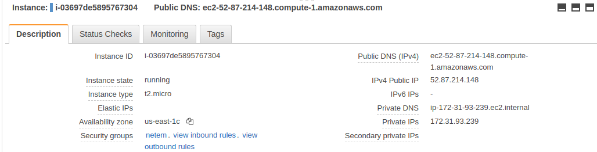
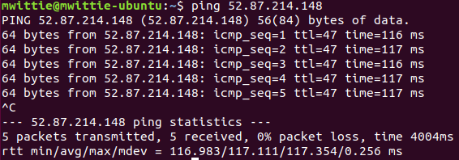
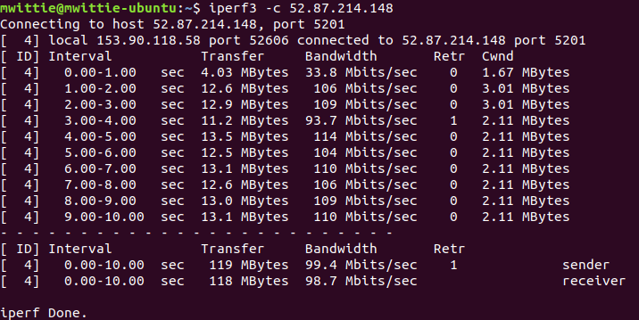
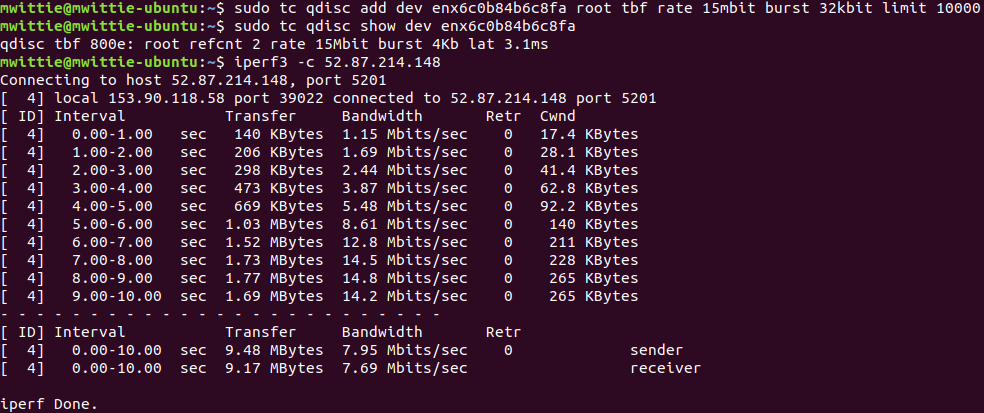

# CSCI 566 Programming Assignment - Network Measurement

## Instructions

Complete the following assignment in your project group.
Submit your work on D2L into the “Programming Assignment 1” group submission folder.

## Learning Objectives

In this programming assignment you will:

- Set up AWS
- Measure network performance to an AWS EC2 instance
- Control network performance

## Overview

In this project you will learn how to set up an AWS instance and measure network performance between your computer and that instance.
You will also learn how to control network performance between your computer and AWS to adjust network performance in your measurements.

The purpose of this assignment with respect to the later class project is for us to be able to normalize the network conditions to different servers and to separate the impact of network delay from other operations.

## Assignment

### Setting up AWS

1. Create an account on [AWS Educate](https://aws.amazon.com/education/awseducate/)
2. Log in to [AWS Educate](https://aws.amazon.com/education/awseducate/)
3. Click on 'AWS Account'
4. Click on 'Go to your AWS Educate Starter Account'
5. Click on 'AWS Console'
6. Create an EC2 instance based on Ubuntu 18.04 LTS image.
As a part of that process you will create and save a new private key, a `.pem` file, to log into your instance. __Make sure that you save this file NOT in your public code repository. It will be stolen and used by cryptocurrency miners.__

  You should now be able to see the details of your instance including its public DNS, IP address, and security groups.

  

7. Set up the security group for your instance that has the following inbound and outbound firewall rules.

  
  

8. Log in to your instance with

  `ssh -i ~/google_drive/Teaching/CSCI 566/CSCI_566.pem ubuntu@ec2-52-87-214-148.compute-1.amazonaws.com`

  You will need to replace the location of your private key and use the address of your instance.

### Setting up measurement tools

1. To measure latency you will use the `ping` command. Look up the IP address of your EC2 instance in your AWS console and issue the following command from your computer (not the instance).

  

  Again, make sure you are pinging your own instance by setting the correct IP.

2. To measure bandwidth you will use the `iperf3` command.
  To install `iperf3` run the following commands on your instance and on your own computer:

  `sudo apt update`

  `sudo apt install iperf3`

  To run `iperf3` execute

  `iperf3 -s`

  on your instance and

  

  on your computer.

3. From the output of these tools we can understand the network performance between your computer and your EC2 instance.
Specifically, `ping` tells us that the mean latency was 117ms and packet loss 0%.
`iperf3` gives us mean bandwidth of close to 100Mbps in both directions.

  `iperf3` can measure bandwidth in a variety of ways, including using UDP, rather than TCP packets.
  Here is a [link](https://aws.amazon.com/premiumsupport/knowledge-center/network-throughput-benchmark-linux-ec2/) to a quick tutorial, but consider also checking out the `man iperf3` page.

### Setting up traffic control (`tc`)

1. To control the latency and bandwidth of your connection to your EC2 instance we will use the `tc` (traffic control) package.
  To install `tc` run the following command on your computer:

  `sudo apt install iproute2`

2. You may now:

  - increase base latency to 200ms on the `eth0` interface

    `sudo tc qdisc add dev eth0 root netem delay 200ms`

  - see the current rule

    `sudo tc qdisc show dev eth0`

  - delete the current rule

    `sudo tc qdisc del dev eth0 root`

  - introduce packet loss

    `sudo tc qdisc add dev eth0 root netem loss 10%`

  - introduce packet corruption

    `sudo tc qdisc add dev eth0 root netem corrupt 5%`

  - or limit bandwidth

    `sudo tc qdisc add dev eth0 root tbf rate 1mbit burst 32kbit limit 10000`

  For example the result of the last rule on `iperf3` is

  

There is much more to `tc` and you should become familiar with its [documentation](https://www.lartc.org/lartc.html#LARTC.QDISC) and how people are using it base on online forum discussions

### Configuring `tc`

Your creative task in this assignment is to discover the relationship between the `tc` settings and the actual network performance.

In this assignment I would like you to answer the following questions based on measurement, graphed results, and analysis:

1. What is the relationship between `tc` latency setting and the measured latency to your EC2 instance.

2. What is the relationship between `tc` loss setting and the measured loss to your EC2 instance.

3. What is the relationship between `tc` bandwidth setting and the measured bandwidth to your EC2 instance.

4. How long does it take to open a TCP socket between a client and a server so that a client can start sending data under different conditions of latency?

5. How long does it take to download a file from an EC2 instance under different conditions of latency and bandwidth.

6. What if you compress the file before a transmission? Estimate the time of compression process using network measurement alone.

Submit your answers as a LaTeX-generated PDF.
