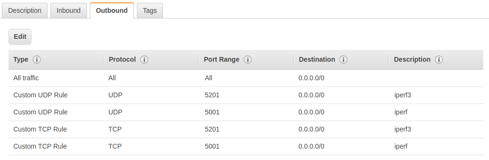

# CSCI 566 Programming Assignment - Network Measurement

## Instructions

Complete the following assignment in your project group.
Submit your work on D2L into the “Programming Assignment 1” group submission folder.

## Learning Objectives

In this programming assignment you will:

- Set up AWS
- Measure network performance to an AWS EC2 instance
- Control network performance

## Overview

In this project you will learn how to set up an AWS instance and measure network performance between your computer and that instance.
You will also learn how to control network performance between your computer and AWS to adjust network performance in your measurements.

## Assignment

### Setting up AWS

1. Create an account on [AWS Educate](https://aws.amazon.com/education/awseducate/)
2. Log in to [AWS Educate](https://aws.amazon.com/education/awseducate/)
3. Click on 'AWS Account'
4. Click on 'Go to your AWS Educate Starter Account'
5. Click on 'AWS Console'
6. Create an EC2 instance based on Ubuntu 18.04 LTS image.
As a part of that process you will create and save a new private key, a `.pem` file, to log into your instance. __Make sure that you save this file NOT in your public code repository. It will be stolen and used by cryptocurrency miners.__
7. Set up the security group for your instance that has the following permissions.

  
  

8. Log in to your instance with
  `ssh -i ~/google_drive/Teaching/CSCI 566/CSCI_566.pem ubuntu@ec2-52-87-214-148.compute-1.amazonaws.com`.
  You will need to replace the location of your private key and use the address of your instance.
