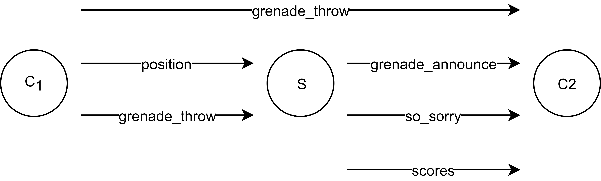

# CSCI 566 Programming Assignment - Publish/Subscribe Systems

## Instructions

Complete the following assignment in your project group.
Submit your work on D2L into the “Programming Assignment 4” group submission folder.

## Learning Objectives

In this programming assignment you will:

 - Implement a network communication application using a publish/subscribe system
 - Benchmark the performance of one of the pub/sub technologies discussed in class

## Overview

In this project you will continue the process of measuring the performance of the different communication technologies currently available for implementation of augmented reality&nbsp;(AR) services.
The set of technologies we will consider in this assignment is:

  - Apache Kafka
  - Apache Pulsar
  - Google Cloud Pub/Sub
  - Akka

Your task is to set up a basic network communication application using one of the technologies and measure its performance within the framework parameters, factors, and metrics and define your experiment.
Additionally there are a number of pub/sub technologies our there.
If you are interested in using a technology not on the list above, please talk with me first.

## Assignment

### Building a network application

Build a network application that simulates the types of transmissions that would ultimately be a part of a "Grenades" application.
For reference here is the schematic of communications within "Grenades" we have been discussing in class.

Notice that there are two `grenade_throw` messages.
They represent implementation options for how a client might announce a grenade to other clients - either directly, or through the server.

The "Grenades" application may need to perform the following transmissions:
  - client to server (c-s) transmission. For example, a client sends a `position` message to the server.
  - server to client (s-c) transmission. For example, the server sends a `so_sorry` message to a client.
  - client to client (c-c) transmission. For example, a client sends a `grenade` message to another client.
  - client to server to client (c-s-c) transmission. For example, a client sends a `grenade` message to another client through a the server.
  - client to multiple clients (c-cc) transmission. For example, a client sends a `grenade` message to multiple clients.
  - server to multiple clients (s-cc) transmission. For example, the server sends a `scores` message to multiple clients.

For the purpose of benchmarking there is no difference between c-s and s-c, etc., and so we can simplify these to:
c-s, c-s-c, s-cc.
For each transmission you do not need to at this point implement a real "Grenades" message, but only transmit a message of certain size.

Implement the application using one of the available messaging technologies.
You may use any language and any set of packages you like.
If you are using hosted services you need to make sure that you can achieve the performance required in experiment 0 below.

You may place your application nodes on different AWS instances and control delay between them using tc/netem.
Alternatively, you may deploy your application nodes inside [Mininet](http://mininet.org/), which you learned to use in CSCI&nbsp;466.

### Measuring communication performance

To measure the communication performance of your application we need to first define the set of parameters, factors, and metrics.

The __factors__ are the different communication scenarios: c-s, c-s-c, and s-cc.

The __parameters__ will be:
  - message size from 1B to 1MB
  - message frequency with which a client sends, for example, a position update from 100 per second to 1 per second
  - number of clients for group communications from 2 to 5
  - network latency
  - network bandwidth
  - network packet loss

The __metrics__ will be:
  - connect time in milliseconds
  - message delay in milliseconds
  - message error rate in percent
  - protocol overhead in bytes

The number of graphs you could generate based on these is number of factors times number of parameters times number of metrics.
That is a lot of graphs!
To make the task manageable we will restrict your evaluation to the following experiments:

  0. Make sure that your network settings work.
  Set bidirectional latency (there and back) to 30ms, bandwidth to 10Mbps, and loss to 1%.
  These settings must be active simultaneously - no one or the other.
  Measure your network latency, bandwidth, and loss and show that network performance conforms to the settings.
  Doing these steps will ensure that the following experiments measure the impact of network performance, not just the settings.

  1. For the c-s factor measure the min, mean, and max connect time.
  Set bidirectional latency (there and back) to 30ms - that will allow us to estimate the number of round trips and compare results across the different technologies evaluated by different groups.
  Set bandwidth to 10Mbps and loss to 0%.

  2. Repeat the above experiment for the s-cc scenario by varying the number of nodes from 2 to 5 by 1.

  3. For the c-s, c-s-c factor measure min, mean, and max message delay.
  You will need to implement message forwarding functionality on your server.
  Set latency to 30ms, bandwidth to 10Mbps, and loss to 0%.
  Vary message payload size from 1B to 1MB by a factor of 2, i.e, 1B, 2B, 4B, etc.

  4. Repeat the above experiment for the s-cc scenario by varying the number of nodes from 2 to 5 by 1.
  Set message payload size to 32B.

  5. Repeat experiment 3 by setting message size to 32B and varying loss from 0% to 2% by 0.2%.

  6. Repeat experiment 4 by setting number of nodes to 3 and varying loss from 0% to 2% by 0.2%.

  7. Repeat experiment 5 and measure min, mean, and max message error rate.

  8. Repeat experiment 6 and measure min, mean, and max message error rate.

  9. For the c-s factor measure protocol overhead in bytes calculated as message size minus payload size.
  You may obtain message size using Wireshark.
  Set latency to 30ms, bandwidth to 10Mbps, and loss to 0%.
  Vary message size from 1B to 1MB by a factor of 2, i.e, 1B, 2B, 4B, etc.

  10. For the c-s-c factor measure min, mean, and max message delay.
  Set latency to 30ms, bandwidth to 10Mbps, loss to 0%, and message size to 32B.
  Vary message transmission rate from 256 per second to 1 per second by a factor of 2.

### What to submit

Submit your measurements recorded in a copy of [this spreadsheet](https://github.com/msu-netlab/MSU_CSCI_566_PAs/blob/pub_sub/results.xlsx).
Additionally, submit a PDF describing:
  1. Your experimental setup
  2. Any encountered limitations of the message queues technology you used.
